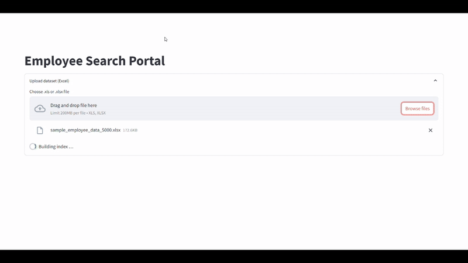

# Employee Search – Full‑Stack Demo



A concise, production‑oriented system that lets HR upload an **Excel** roster of
employees, then retrieve the Top‑N best‑matching candidates using semantic role
similarity **plus** strict skill‑keyword and age filters.

* **`utils/hr_search_engine.py`** – reusable `EmployeeSearchEngine` class (FAISS + Sentence‑Transformers)
* **`main.py`**                     – FastAPI service (`/dataset`, `/search`, `/health`)
* **`utils/ui_app.py`**             – Streamlit UI (backend URL from .env file or use the url hard-coded in the file)
* **`test_fastapi.py`**            – tiny script that demonstrates calling the REST API
* **`data/sample_employee_data_5000.xlsx`** – 5 000‑row demo dataset
* **`Sample_HR_Queries_for_Employee_Search.csv`** – ready‑made queries & skills for testing
* **`Dockerfile`** – multi‑stage build based on **`python:3.12‑slim`** (backend + frontend)

---

## Quick Start (local)

```bash
python -m venv .venv && source .venv/bin/activate  # optional virtual‑env
pip install -r requirements.txt                    # installs FastAPI, FAISS‑CPU, Streamlit, etc.

# 1) run backend (reload keeps dev‑experience snappy)
uvicorn main:app --reload --port 8000

# 2) in another shell start the Streamlit UI
streamlit run utils/ui_app.py
```

Open **[http://localhost:8501](http://localhost:8501)** and:

1. Drag‑and‑drop `data/sample_employee_data_5000.xlsx` (*or your own sheet*). The index is built automatically.
2. Enter a requirement sentence, comma‑separated mandatory skills, and an age range.
3. Click **Search** – the UI shows how many candidates were found and the detailed cards.

> **Tip:** Use the sample query CSV (`Sample_HR_Queries_for_Employee_Search.csv`) to copy‑paste realistic test cases.

---

## Run Everything in Docker

```bash
# Build (takes ~5 minutes first time)
docker build -t employee-search .

# Run (detached)
docker run -d -p 8000:8000 -p 8501:8501 --name empsearch employee-search
```

| URL                          | Purpose              |
| ---------------------------- | -------------------- |
| `http://localhost:8000/docs` | Interactive API docs |
| `http://localhost:8501`      | Streamlit front‑end  |

The container launches **both** FastAPI (port 8000) and Streamlit (port 8501) using.

---

## Testing the API Directly

```bash
python test_fastapi.py               # simple script that uploads the Excel file and runs example queries
```

Or manual cURL:

```bash
# 1. upload dataset
curl -F "file=@data/sample_employee_data_5000.xlsx" \
     http://localhost:8000/dataset
#  -> {"dataset_id":"abcd1234"}

# 2. run a search
curl -X POST http://localhost:8000/search -H "Content-Type: application/json" \
     -d '{
           "dataset_id": "abcd1234",
           "query": "Analytics engineer for Snowflake and dbt",
           "skills": ["snowflake", "dbt"],
           "age_min": 30,
           "age_max": 50,
           "top_k": 5
         }'
```

---

## Project Layout

```
.
├── data/
│   └── sample_employee_data_5000.xlsx
├── utils/
│   ├── hr_search_engine.py          # core search engine class
│   └── ui_app.py                    # Streamlit front‑end
├── media/
|   └── demo.gif                     # demo video 
├── main.py                          # FastAPI service
├── test_fastapi.py                  # demo client
├── Sample_HR_Queries_for_Employee_Search.csv
├── Dockerfile                       # multi‑stage container build (Py 3.12‑slim)
└── requirements.txt
```

---

## Environment Variables

| Variable   | Default   | Purpose                                                            |
| ---------- | --------- | ------------------------------------------------------------------ |
| `API_PORT` | `8000`    | internal FastAPI port in Docker                                    |
| `UI_PORT`  | `8501`    | internal Streamlit port in Docker                                  |
| `API_BASE` | *not set* | override back‑end URL for `ui_app.py` if back‑end not on localhost in the .env named as `API_BASE` |

---